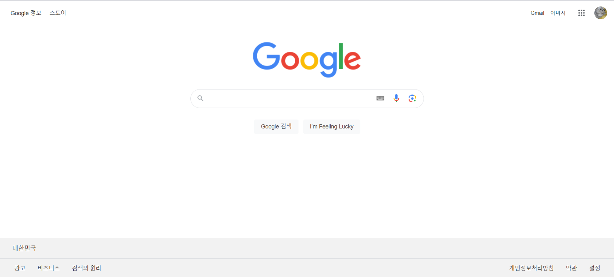
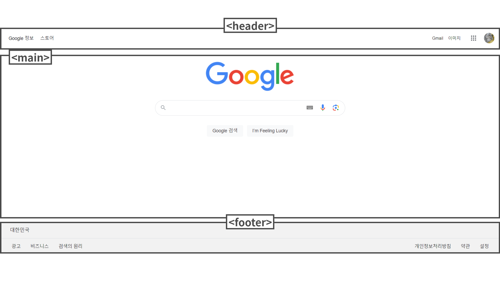
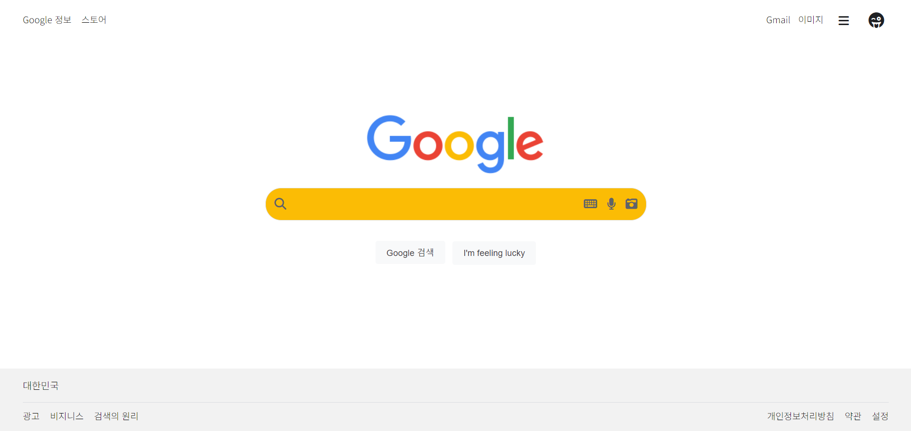
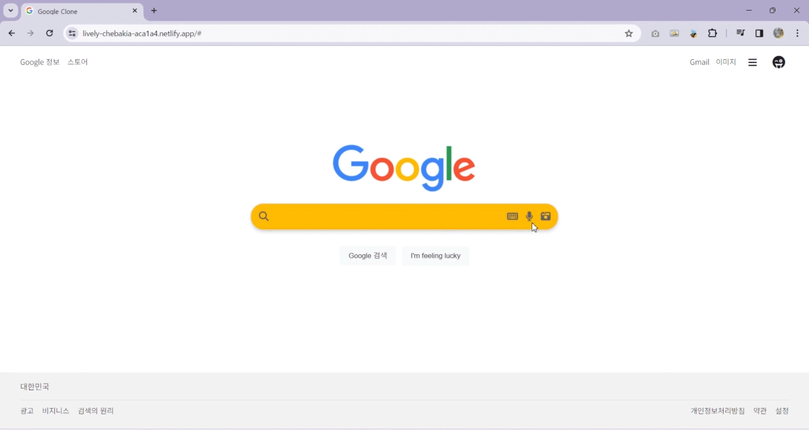

# 230110-230111 Google 클론 코딩

---

## 1. CSS 구조 파악



## 2. CSS 구조 확인



## 3. 완료 모습




### 미디어 쿼리를 이용한 모바일 사이즈 시 깨짐 수정

- 초기 구현은 <a href="(https://d01c67be-98c7-416e-ab23-dce592f099ce-00-2souyyah294vt.sisko.repl.co/" tite="Replit 이동" target="_blank">Replit</a> 또는 <a href="(https://teal-catcher-309.notion.site/230110-230111-Google-bede8e5927f8483d873a2f16147f378a?pvs=74" tite="Notion 이동" target="_blank">Notion</a> 참조

```css
@media (max-width: 720px) {
	main .input-area {
		width: 400px;
	}
}

@media (max-width: 540px) {
	header .info,
	header .nav .g-mail,
	header .nav .g-image {
		display: none;
	}

	main {
		flex-grow: 3;
	}

	main .input-area {
		width: 300px;
		/* padding: 0 3%; */
	}

	footer {
		flex-grow: 2;
	}

	footer .footer-nav {
		display: flex;
		flex-direction: column;
		justify-content: center;
		align-items: center;
	}
}

@media (max-width: 320px) {
	main .input-area {
		width: 50px;
		height: 50px;
		border-radius: 100%;
	}
	main .input-area .icon-search {
		margin: 0 auto;
	}
	main .input-area input {
		display: none;
	}
	main .icon-etc {
		display: none;
	}
}
```

### Google Fonts

가장 유사한 웹 폰트로 대체

```html
<!-- FONT -->
<link rel="preconnect" href="https://fonts.googleapis.com" />
<link rel="preconnect" href="https://fonts.gstatic.com" crossorigin />
<link
	href="https://fonts.googleapis.com/css2?family=Noto+Sans+KR:wght@100;300;700&display=swap"
	rel="stylesheet"
/>
<link
	rel="stylesheet"
	href="https://fonts.googleapis.com/css2?family=Material+Symbols+Outlined:opsz,wght,FILL,GRAD@20..48,100..700,0..1,-50..200"
/>
```

### Favicon

구글 제공 favicon 사용

```html
<!-- FAVICON -->
<link rel="icon" href="https://www.google.com/favicon.ico" />
```

### Icon

무난한
<a href="(https://fontawesome.com/" tite="fontawsome 이동" target="_blank">Font Awsome</a> 사용
